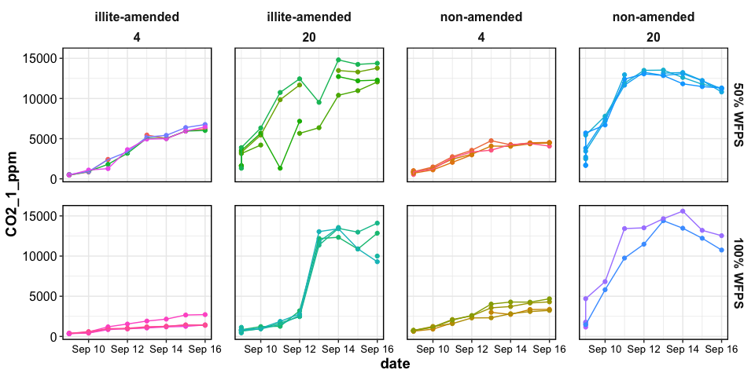

preliminary results
================

final cores F31, F32 removed

-----

# RESPIRATION

## CO2 concentrations

**by core**

<!-- -->

## CO2 fluxes

**by core**

<!-- -->

**means**

<!-- -->

-----

# DOC

<!-- -->

## summary table

| Time    | Temp\_C | Moisture  | Non-Amended  | Illite-Amended |
| :------ | ------: | :-------- | :----------: | :------------- |
| Initial |       4 | 50% WFPS  | 55.39 ± 2.87 | 54.26 ± 1.2    |
| Initial |       4 | 100% WFPS | 32.62 ± 3.03 | 45.95 ± 3.57   |
| Initial |      20 | 50% WFPS  | 52.21 ± 3.27 | 57.48 ± 1.6    |
| Initial |      20 | 100% WFPS | 35.05 ± 6.18 | 41.27 ± 1.85   |
| Final   |       4 | 50% WFPS  | 34.81 ± 0.73 | 41.24 ± 2.91   |
| Final   |       4 | 100% WFPS | 27.81 ± 1.11 | 28.66 ± 1.07   |
| Final   |      20 | 50% WFPS  | 34.15 ± 0.76 | 31.21 ± 1.51   |
| Final   |      20 | 100% WFPS | 24.44 ± 7.23 | 20.91 ± 0.24   |

<details>

<summary>stats</summary>

``` r
aov_doc_initial = aov(doc_ppm ~ Temp_C * Moisture * Clay, 
                      data = doc %>% filter(Time=="Initial"))
summary(aov_doc_initial)
#>                      Df Sum Sq Mean Sq F value   Pr(>F)    
#> Temp_C                1    2.4     2.4   0.057   0.8139    
#> Moisture              1 2076.1  2076.1  48.029 3.63e-07 ***
#> Clay                  1  280.5   280.5   6.490   0.0177 *  
#> Temp_C:Moisture       1    2.6     2.6   0.061   0.8078    
#> Temp_C:Clay           1    0.3     0.3   0.006   0.9396    
#> Moisture:Clay         1  118.8   118.8   2.748   0.1104    
#> Temp_C:Moisture:Clay  1   91.0    91.0   2.104   0.1598    
#> Residuals            24 1037.4    43.2                     
#> ---
#> Signif. codes:  0 '***' 0.001 '**' 0.01 '*' 0.05 '.' 0.1 ' ' 1

aov_doc_final = aov(doc_ppm ~ Temp_C * Moisture * Clay, 
                    data = doc %>% filter(Time=="Final"))
summary(aov_doc_final)
#>                      Df Sum Sq Mean Sq F value   Pr(>F)    
#> Temp_C                1  237.9   237.9   7.156   0.0132 *  
#> Moisture              1  783.6   783.6  23.570 6.01e-05 ***
#> Clay                  1    0.3     0.3   0.010   0.9215    
#> Temp_C:Moisture       1    0.1     0.1   0.003   0.9577    
#> Temp_C:Clay           1   94.4    94.4   2.838   0.1050    
#> Moisture:Clay         1   19.0    19.0   0.571   0.4572    
#> Temp_C:Moisture:Clay  1   12.4    12.4   0.374   0.5465    
#> Residuals            24  797.9    33.2                     
#> ---
#> Signif. codes:  0 '***' 0.001 '**' 0.01 '*' 0.05 '.' 0.1 ' ' 1
```

</details>

-----

<details>

<summary>Session Info</summary>

date run: 2020-07-18

    #> R version 4.0.1 (2020-06-06)
    #> Platform: x86_64-apple-darwin17.0 (64-bit)
    #> Running under: macOS Mojave 10.14.6
    #> 
    #> Matrix products: default
    #> BLAS:   /Library/Frameworks/R.framework/Versions/4.0/Resources/lib/libRblas.dylib
    #> LAPACK: /Library/Frameworks/R.framework/Versions/4.0/Resources/lib/libRlapack.dylib
    #> 
    #> locale:
    #> [1] en_US.UTF-8/en_US.UTF-8/en_US.UTF-8/C/en_US.UTF-8/en_US.UTF-8
    #> 
    #> attached base packages:
    #> [1] stats     graphics  grDevices utils     datasets  methods   base     
    #> 
    #> other attached packages:
    #>  [1] lubridate_1.7.9 forcats_0.5.0   stringr_1.4.0   dplyr_1.0.0    
    #>  [5] purrr_0.3.4     readr_1.3.1     tidyr_1.1.0     tibble_3.0.1   
    #>  [9] ggplot2_3.3.2   tidyverse_1.3.0 here_0.1       
    #> 
    #> loaded via a namespace (and not attached):
    #>  [1] tidyselect_1.1.0   xfun_0.15          haven_2.3.1        colorspace_1.4-1  
    #>  [5] vctrs_0.3.1        generics_0.0.2     htmltools_0.5.0    yaml_2.2.1        
    #>  [9] blob_1.2.1         rlang_0.4.6        pillar_1.4.4       glue_1.4.1        
    #> [13] withr_2.2.0        DBI_1.1.0          dbplyr_1.4.4       modelr_0.1.8      
    #> [17] readxl_1.3.1       lifecycle_0.2.0    munsell_0.5.0      gtable_0.3.0      
    #> [21] cellranger_1.1.0   rvest_0.3.5        evaluate_0.14      labeling_0.3      
    #> [25] knitr_1.28         fansi_0.4.1        highr_0.8          broom_0.7.0       
    #> [29] Rcpp_1.0.4.6       scales_1.1.1       backports_1.1.8    jsonlite_1.6.1    
    #> [33] farver_2.0.3       fs_1.4.1           hms_0.5.3          digest_0.6.25     
    #> [37] stringi_1.4.6      grid_4.0.1         rprojroot_1.3-2    cli_2.0.2         
    #> [41] tools_4.0.1        magrittr_1.5       crayon_1.3.4       pkgconfig_2.0.3   
    #> [45] ellipsis_0.3.1     xml2_1.3.2         reprex_0.3.0       assertthat_0.2.1  
    #> [49] rmarkdown_2.3      httr_1.4.1         rstudioapi_0.11    soilpalettes_0.1.0
    #> [53] R6_2.4.1           compiler_4.0.1

</details>
