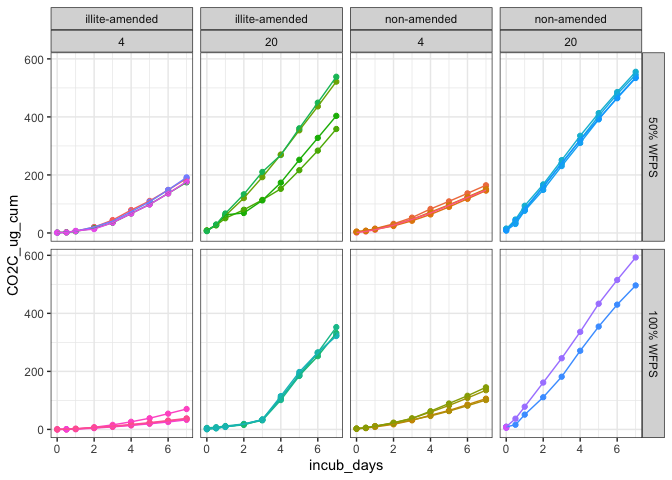
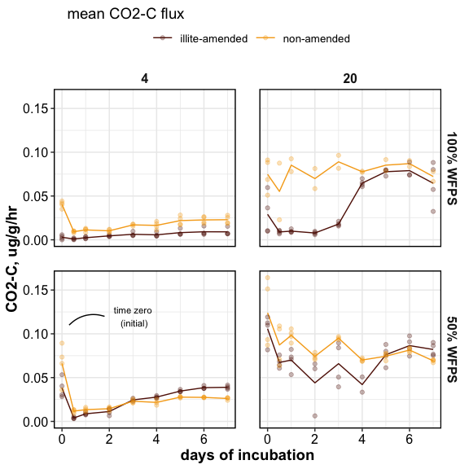
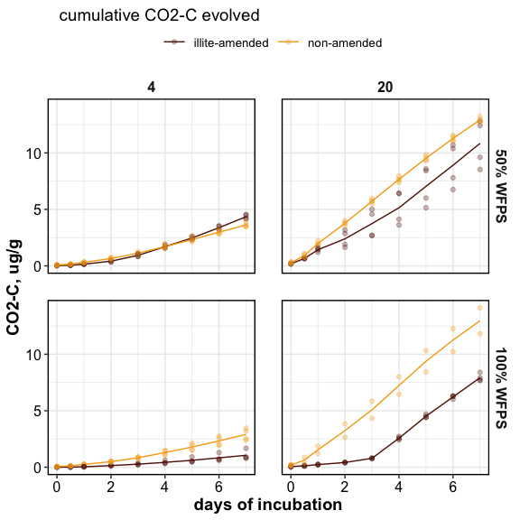

preliminary results
================

final cores F31, F32 removed

-----

### Hypotheses:

1)  increased **temperature** would destabilize MAOM, increasing the
    bioavailable DOM and C mineralization (also increase microbial
    activity);
2)  increased **moisture content** would improve hydrologic
    connectivity, increasing CO2 flux; and
3)  higher temperature would have a greater destabilization effect on
    SOM than higher moisture, because —.
4)  Since sorption to mineral surfaces is an important/dominant
    mechanism of SOM stabilization, we also hypothesized that
    destabilization of SOM due to increased temperature and/or moisture
    would be less in **clay-rich soils**.

-----

-----

# RESPIRATION

  - cumulative CO2 evolution was influenced by temperature and clay
    amendments, but not by moisture content
  - CO2 evolution was greater at 20 C than at 4 C
  - CO2 evolution was reduced in clay-amended soils. this effect was
    seen only at 20 C

-----

## core-wise graphs

**CO2-C concentrations**

<!-- -->

**CO2-C fluxes**

<!-- -->

**cumulative CO2-C evolved**

<!-- -->

note: some cores are missing time-points. missing values must be filled
in with interpolation

## mean/summary graphs

<!-- -->

<!-- -->

## stats

``` r
(cum_flux_aov = car::Anova(lm(CO2C_ug_cum ~ (Temperature + Clay + Moisture)^2, 
                             data = flux), 
                          type = "III")
)
#> Anova Table (Type III tests)
#> 
#> Response: CO2C_ug_cum
#>                       Sum Sq  Df F value    Pr(>F)    
#> (Intercept)            29986   1  2.1710   0.14182    
#> Temperature           349304   1 25.2905 9.098e-07 ***
#> Clay                    8842   1  0.6402   0.42435    
#> Moisture               29669   1  2.1481   0.14393    
#> Temperature:Clay       86190   1  6.2404   0.01309 *  
#> Temperature:Moisture   13637   1  0.9873   0.32130    
#> Clay:Moisture          25638   1  1.8563   0.17421    
#> Residuals            3660090 265                      
#> ---
#> Signif. codes:  0 '***' 0.001 '**' 0.01 '*' 0.05 '.' 0.1 ' ' 1
```

**cumulative CO2-C evolved (ug/g)**

| Temperature | Moisture  | illite-amended | non-amended  |
| ----------: | :-------- | :------------- | :----------- |
|           4 | 50% WFPS  | 4.35 ± 0.1     | 3.63 ± 0.1   |
|           4 | 100% WFPS | 1.06 ± 0.21    | 2.9 ± 0.26   |
|          20 | 50% WFPS  | 10.84 ± 1.05   | 12.92 ± 0.12 |
|          20 | 100% WFPS | 7.92 ± 0.16    | 6.56 ± 3.73  |

-----

# DOC

  - DOC for initial soils was influenced by moisture content and clay
    amendment, but not by temperature (the soils were air-dried, which
    may have caused destabilization of protected C – and that may have
    masked any temperature effects)
  - after the 7-day incubation, DOC was influenced by moisture, but not
    by clay amendment or temperature

<!-- -->

## summary table

| Time    | Temp\_C | Moisture  | Non-Amended  | Illite-Amended |
| :------ | ------: | :-------- | :----------- | :------------- |
| Initial |       4 | 50% WFPS  | 55.39 ± 2.87 | 54.26 ± 1.2    |
| Initial |       4 | 100% WFPS | 32.62 ± 3.03 | 45.95 ± 3.57   |
| Initial |      20 | 50% WFPS  | 52.21 ± 3.27 | 57.48 ± 1.6    |
| Initial |      20 | 100% WFPS | 35.05 ± 6.18 | 41.27 ± 1.85   |
| Final   |       4 | 50% WFPS  | 34.81 ± 0.73 | 41.24 ± 2.91   |
| Final   |       4 | 100% WFPS | 27.81 ± 1.11 | 28.66 ± 1.07   |
| Final   |      20 | 50% WFPS  | 34.15 ± 0.76 | 31.21 ± 1.51   |
| Final   |      20 | 100% WFPS | 24.44 ± 7.23 | 20.91 ± 0.24   |

<details>

<summary>stats</summary>

``` r
aov_doc_initial = aov(doc_ppm ~ (Temp_C + Moisture + Clay)^2, 
                    data = doc %>% filter(Time=="Initial"))
summary(aov_doc_initial)
#>                 Df Sum Sq Mean Sq F value   Pr(>F)    
#> Temp_C           1    2.4     2.4   0.054   0.8178    
#> Moisture         1 2076.1  2076.1  45.997 4.15e-07 ***
#> Clay             1  280.5   280.5   6.216   0.0196 *  
#> Temp_C:Moisture  1    2.6     2.6   0.058   0.8117    
#> Temp_C:Clay      1    0.3     0.3   0.006   0.9408    
#> Moisture:Clay    1  118.8   118.8   2.631   0.1173    
#> Residuals       25 1128.4    45.1                     
#> ---
#> Signif. codes:  0 '***' 0.001 '**' 0.01 '*' 0.05 '.' 0.1 ' ' 1

aov_doc_final = aov(doc_ppm ~ (Temp_C + Moisture + Clay)^2, 
                    data = doc %>% filter(Time=="Final"))
summary(aov_doc_final)
#>                 Df Sum Sq Mean Sq F value   Pr(>F)    
#> Temp_C           1  237.9   237.9   7.340    0.012 *  
#> Moisture         1  783.6   783.6  24.175 4.62e-05 ***
#> Clay             1    0.3     0.3   0.010    0.920    
#> Temp_C:Moisture  1    0.1     0.1   0.003    0.957    
#> Temp_C:Clay      1   94.4    94.4   2.911    0.100    
#> Moisture:Clay    1   19.0    19.0   0.586    0.451    
#> Residuals       25  810.3    32.4                     
#> ---
#> Signif. codes:  0 '***' 0.001 '**' 0.01 '*' 0.05 '.' 0.1 ' ' 1
```

</details>

-----

<details>

<summary>Session Info</summary>

date run: 2020-08-18

    #> R version 4.0.2 (2020-06-22)
    #> Platform: x86_64-apple-darwin17.0 (64-bit)
    #> Running under: macOS Catalina 10.15.6
    #> 
    #> Matrix products: default
    #> BLAS:   /Library/Frameworks/R.framework/Versions/4.0/Resources/lib/libRblas.dylib
    #> LAPACK: /Library/Frameworks/R.framework/Versions/4.0/Resources/lib/libRlapack.dylib
    #> 
    #> locale:
    #> [1] en_US.UTF-8/en_US.UTF-8/en_US.UTF-8/C/en_US.UTF-8/en_US.UTF-8
    #> 
    #> attached base packages:
    #> [1] stats     graphics  grDevices utils     datasets  methods   base     
    #> 
    #> other attached packages:
    #>  [1] lubridate_1.7.9 forcats_0.5.0   stringr_1.4.0   dplyr_1.0.1    
    #>  [5] purrr_0.3.4     readr_1.3.1     tidyr_1.1.1     tibble_3.0.3   
    #>  [9] ggplot2_3.3.2   tidyverse_1.3.0 here_0.1       
    #> 
    #> loaded via a namespace (and not attached):
    #>  [1] Rcpp_1.0.5         assertthat_0.2.1   rprojroot_1.3-2    digest_0.6.25     
    #>  [5] R6_2.4.1           cellranger_1.1.0   backports_1.1.8    reprex_0.3.0      
    #>  [9] evaluate_0.14      httr_1.4.2         highr_0.8          pillar_1.4.6      
    #> [13] soilpalettes_0.1.0 rlang_0.4.7        curl_4.3           readxl_1.3.1      
    #> [17] rstudioapi_0.11    data.table_1.13.0  car_3.0-9          blob_1.2.1        
    #> [21] rmarkdown_2.3      labeling_0.3       foreign_0.8-80     munsell_0.5.0     
    #> [25] broom_0.7.0        compiler_4.0.2     modelr_0.1.8       xfun_0.16         
    #> [29] pkgconfig_2.0.3    htmltools_0.5.0    tidyselect_1.1.0   rio_0.5.16        
    #> [33] fansi_0.4.1        crayon_1.3.4       dbplyr_1.4.4       withr_2.2.0       
    #> [37] grid_4.0.2         jsonlite_1.7.0     gtable_0.3.0       lifecycle_0.2.0   
    #> [41] DBI_1.1.0          magrittr_1.5       scales_1.1.1       zip_2.1.0         
    #> [45] cli_2.0.2          stringi_1.4.6      carData_3.0-4      farver_2.0.3      
    #> [49] fs_1.5.0           xml2_1.3.2         ellipsis_0.3.1     generics_0.0.2    
    #> [53] vctrs_0.3.2        openxlsx_4.1.5     tools_4.0.2        glue_1.4.1        
    #> [57] hms_0.5.3          abind_1.4-5        yaml_2.2.1         colorspace_1.4-1  
    #> [61] rvest_0.3.6        knitr_1.29         haven_2.3.1

</details>
