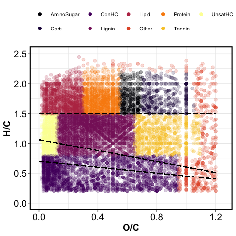
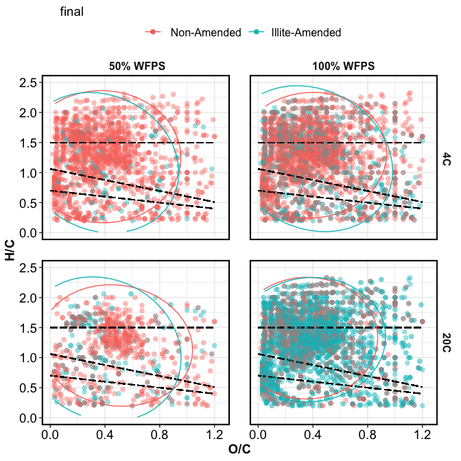
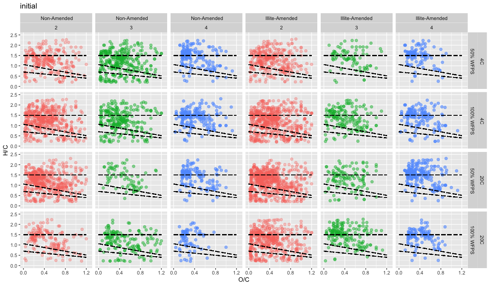
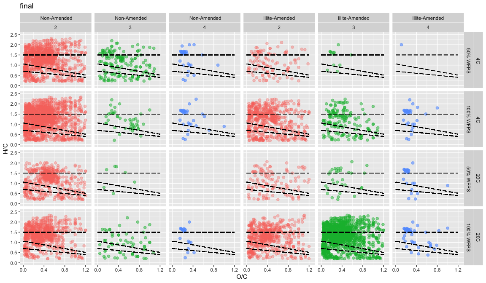

Preliminary Results
================

-----

## FTICR-MS

### Van Krevelen Plots

#### domains

<!-- -->

#### treatment effect

**all peaks detected (not filtered based on number of replicates)**

**initial (pre-conditioned to temp and clay)**

<!-- -->

**final**

<!-- -->

**peaks detected in 2/4 replicates**

**initial (pre-conditioned to temp and clay)**

<!-- -->

**final**

<!-- -->

-----

### FTICR QC

#### How many times was each peak seen?

If n = 4, the peak was seen in all 4 replicates.  
Usually include only peaks seen all/majority of replicates.  
Note: the 20C+100%wfps+non-amended treatment had only 2 replicates
because of contamination.

<!-- --><!-- -->

-----

#### Session Info

date run: 2020-07-01

    #> R version 4.0.1 (2020-06-06)
    #> Platform: x86_64-apple-darwin17.0 (64-bit)
    #> Running under: macOS Mojave 10.14.6
    #> 
    #> Matrix products: default
    #> BLAS:   /Library/Frameworks/R.framework/Versions/4.0/Resources/lib/libRblas.dylib
    #> LAPACK: /Library/Frameworks/R.framework/Versions/4.0/Resources/lib/libRlapack.dylib
    #> 
    #> locale:
    #> [1] en_US.UTF-8/en_US.UTF-8/en_US.UTF-8/C/en_US.UTF-8/en_US.UTF-8
    #> 
    #> attached base packages:
    #> [1] stats     graphics  grDevices utils     datasets  methods   base     
    #> 
    #> other attached packages:
    #> [1] forcats_0.5.0   stringr_1.4.0   dplyr_1.0.0     purrr_0.3.4    
    #> [5] readr_1.3.1     tidyr_1.1.0     tibble_3.0.1    ggplot2_3.3.2  
    #> [9] tidyverse_1.3.0
    #> 
    #> loaded via a namespace (and not attached):
    #>  [1] tidyselect_1.1.0  xfun_0.15         haven_2.3.1       lattice_0.20-41  
    #>  [5] colorspace_1.4-1  vctrs_0.3.1       generics_0.0.2    viridisLite_0.3.0
    #>  [9] htmltools_0.5.0   yaml_2.2.1        blob_1.2.1        rlang_0.4.6      
    #> [13] pillar_1.4.4      glue_1.4.1        withr_2.2.0       DBI_1.1.0        
    #> [17] dbplyr_1.4.4      modelr_0.1.8      readxl_1.3.1      lifecycle_0.2.0  
    #> [21] munsell_0.5.0     gtable_0.3.0      cellranger_1.1.0  rvest_0.3.5      
    #> [25] evaluate_0.14     labeling_0.3      knitr_1.28        fansi_0.4.1      
    #> [29] broom_0.5.6       Rcpp_1.0.4.6      scales_1.1.1      backports_1.1.8  
    #> [33] jsonlite_1.6.1    farver_2.0.3      fs_1.4.1          hms_0.5.3        
    #> [37] digest_0.6.25     stringi_1.4.6     grid_4.0.1        cli_2.0.2        
    #> [41] tools_4.0.1       magrittr_1.5      crayon_1.3.4      pkgconfig_2.0.3  
    #> [45] MASS_7.3-51.6     ellipsis_0.3.1    xml2_1.3.2        reprex_0.3.0     
    #> [49] lubridate_1.7.9   assertthat_0.2.1  rmarkdown_2.3     httr_1.4.1       
    #> [53] rstudioapi_0.11   R6_2.4.1          nlme_3.1-148      compiler_4.0.1
